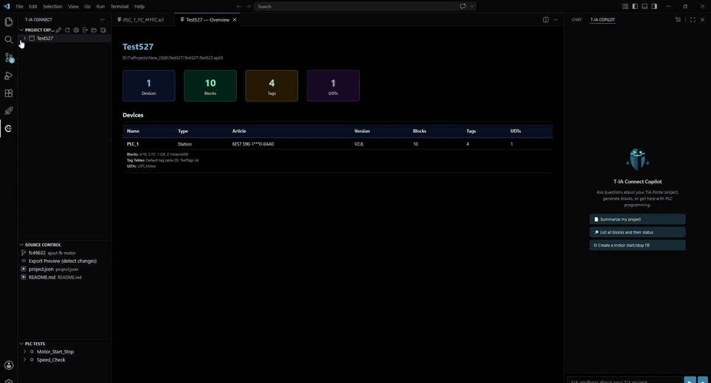
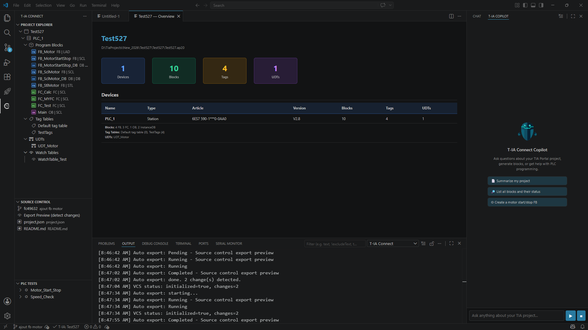
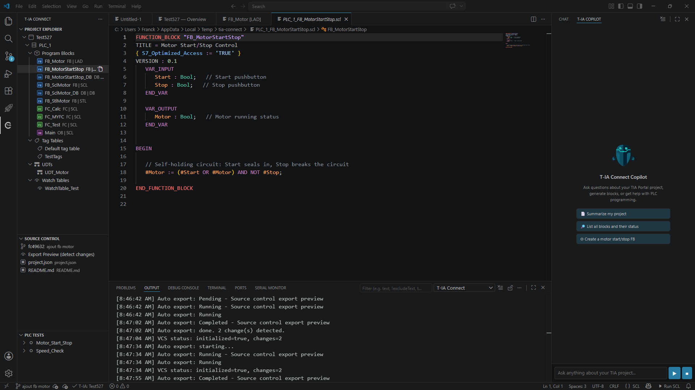
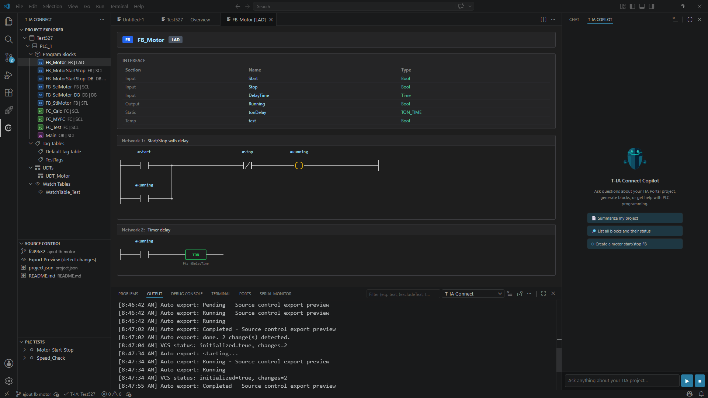
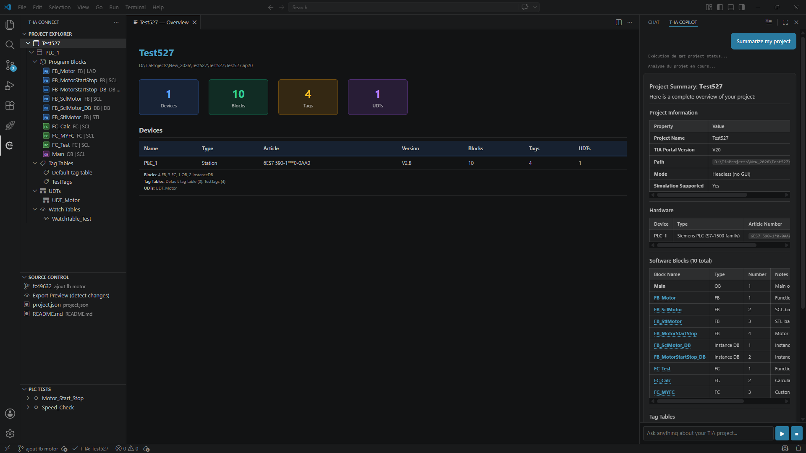

# T-IA Connect for VS Code

Explore, edit, and compile Siemens TIA Portal projects directly from VS Code, Cursor, or Windsurf.

This extension connects to a running [T-IA Connect](https://t-ia-connect.com) server and provides a full development workflow for PLC programming — without leaving your editor.

[](https://github.com/feelautom/tia-connect-vscode/releases)
[](https://code.visualstudio.com/)
[](https://github.com/feelautom/tia-connect-vscode/blob/main/LICENSE)
[](https://github.com/feelautom/tia-connect-vscode)
[](https://www.siemens.com/tia-portal)
[](https://github.com/feelautom/tia-connect-vscode)
[](https://github.com/feelautom/tia-connect-vscode)
[](https://feelautom.com)



> **[View all screenshots](https://feelautom.github.io/tia-connect-vscode/screenshots.html)** — 28 screenshots showing the complete workflow.

---

## Quick Start

1. **Install the extension** from the VS Code Marketplace
2. Click the **T-IA Connect** icon in the Activity Bar (left sidebar)
3. **Sign in** with your T-IA Connect account (or create one for free)
4. If T-IA Connect is not installed, follow the download link in the sidebar
5. Click **Launch Headless** or **Launch with GUI** to start the server
6. Open a TIA Portal project — you're ready to code!

> The API key is configured automatically when the server runs on your machine. No manual setup needed.

---

## Features

### Project Explorer

Browse your TIA Portal project structure directly in VS Code.

- **Device tree**: PLCs, HMIs, and their contents — blocks, tag tables, UDTs, watch tables
- **Block folders**: hierarchical view matching your TIA Portal structure
- **Block icons**: color-coded by type — OB (blue), FB (green), FC (orange), DB (purple)
- **Status indicators**: block language and consistency state at a glance
- **Project Dashboard**: overview panel with device stats, block counts, tag summaries, and UDT counts



### SCL / STL Editing

Double-click any SCL or STL block to open it with full language support. Edit, save (**Ctrl+S**), and it's reimported into TIA Portal automatically.

- **Syntax highlighting** — TextMate grammars for SCL and STL
- **Autocompletion** — keywords, types, variables, and built-in functions
- **Signature Help** — parameter hints for 30+ SCL functions
- **Hover documentation** — type info, function docs, system block documentation (TON, CTU, R_TRIG...)
- **Go-to-Definition** — Ctrl+click on local variables or block names (cross-file via API)
- **Rename Symbol** (F2) — rename a variable across the entire file
- **Diagnostics** — compilation errors mapped to precise source lines (regex + symbol search)
- **Document Outline** — hierarchical view of blocks, sections, and variables
- **15 SCL snippets** — FB, FC, OB, DB, IF, FOR, CASE, TON, R_TRIG...
- **Compilation errors** displayed directly in the editor (red/yellow squiggles at the correct line)
- **Background preloading** — blocks are cached after project load for near-instant opening

#### Save behavior

- **Ctrl+S** (manual save) triggers reimport into TIA Portal + optional auto-compile
- **VS Code auto-save** is ignored — no accidental reimports
- **Safety timer** saves to disk every 5/10/15 minutes without reimporting (configurable)



### LAD / FBD / GRAPH Viewer

Non-editable blocks open in a graphical webview with SVG rendering.

- **Contacts and coils** — NO, NC, positive/negative edge, Set/Reset
- **Function blocks** — 40+ instruction types (TON, TOF, TP, CTU, CTD, CTUD, MOVE, ADD, SUB, MUL, DIV, CMP...) rendered with tinted header, EN/ENO row, and named input/output pins
- **Connected values** — current values (PT, PV, CV, IN1, OUT...) displayed inside each block
- **Parallel branches** — vertical merge connectors and wire routing
- **Interface table** — variable types shown alongside the network
- Read-only — no accidental modifications



### Create Blocks

Right-click any device in the Project Explorer and select **Create Block**.

- Block types: **FB**, **FC**, **OB**, **DB**
- Languages: **SCL**, **STL**, **LAD**, **FBD**, **GRAPH**
- SCL/STL blocks include a ready-to-use code template
- The project tree refreshes automatically

### Compile

Compile a single block or an entire device from the context menu or the Command Palette.

- Progress notification with error/warning count
- Detailed messages in the Output channel
- Compilation errors appear as diagnostics at the correct line in the editor
- Keyboard shortcut: **Ctrl+Shift+B**

### Export / Import

Full bidirectional export and import for all project data.

#### Tags
- Export tag tables as **CSV**, **XLSX**, or **XML**
- Import from **CSV** or **XLSX**

#### UDTs (User-Defined Types)
- Export/import as **XML**

#### Watch Tables
- Export/import watch and force tables

#### HMI
- Export/import individual **HMI screens**
- Bulk export: **screens + tags + connections** in one command

#### Hardware Configuration
- Export/import hardware config (**AML** format)

#### Export All
- One-click export of **tags + UDTs + watch tables** for a device

### Source Control (VCS)

Version your TIA Portal project with Git-based source control, directly in the sidebar.

1. **Export Preview** (eye icon) — export the project and detect changes since the last commit
2. **Review** — click any changed file to open a read-only side-by-side diff
3. **Commit** (checkmark icon) — save the current state with a message

Additional features:
- Push / Pull to remote repositories
- Branch operations: create, switch, delete, merge
- Commit log with diff viewer
- Auto-export every minute (changes appear automatically)
- Auto-refresh status every 30 seconds
- **Smart Comparison** — normalized XML diff (strips IDs, timestamps, whitespace) to detect real changes
- **Dependency Sort** — topological ordering (Kahn's algorithm) for correct import order
- **Orphan Cleanup** — detect blocks deleted in TIA Portal but still in source control
- License check (lock icon if VCS is not included in your edition)

### AI Integration

Three complementary AI features for PLC development:

#### @tia Chat Participant (GitHub Copilot Chat)

Type `@tia` in GitHub Copilot Chat to interact with your TIA Portal project using natural language.

- **30 Language Model Tools** — project overview, block management, compilation, tags, UDTs, cross-references, PLCSim, VCS, pipelines, hardware
- **Agentic loop** — the AI can chain multiple tool calls (up to 10 rounds) to complete complex tasks
- **License check** — verifies AI license before consuming tokens

#### T-IA Connect Copilot (Sidebar)

Dedicated AI assistant in the secondary sidebar, independent of GitHub Copilot.

- Connected to the T-IA Connect server's multi-provider LLM (OpenAI, Anthropic, Google, Mistral, Ollama)
- Chat history, clickable block links, auto-refresh after AI actions
- Connection-aware: shows sign-in or offline state when not connected
- Localized in French



#### MCP Server (100+ Tools)

The T-IA Connect server exposes a **Model Context Protocol** server with 100+ tools. The extension auto-generates `.vscode/mcp.json` so GitHub Copilot Chat can use all MCP tools automatically.

Compatible with: **Claude Desktop**, **Claude Code**, **Cursor**, **Windsurf**, and any MCP client.

### PLC Tests

Run PLC tests against PLCSim Advanced from the sidebar.

- Automatic license and PLCSim availability checks
- Run individual tests or the entire suite
- Detailed results: pass/fail badges, step cards, assertions table with expected vs actual values
- Duration and timestamps

### Cross-References

View cross-references for any block type (SCL, STL, LAD, FBD, GRAPH).

- Source and target references with type badges
- Read/Write access indicators
- Dedicated webview panel alongside the editor

### Pipelines (CI/CD)

Define and run CI/CD pipelines for your TIA Portal projects.

- List, run, and monitor pipelines
- Create from built-in templates
- Execution history with step-level details

### Workspace Scaffolding

Initialize a TIA-ready workspace with one command:

- `.gitignore` with TIA Portal patterns (*.ap*, *.zap*, .tia-temp/)
- `.github/copilot-instructions.md` for GitHub Copilot context
- `CLAUDE.md` for Claude Code context

---

## Authentication

The extension uses two independent layers:

| Layer | Purpose | How it works |
|-------|---------|--------------|
| **T-IA Connect Account** | Identifies you, checks your license | Sign in via browser — token stored securely in your OS keyring |
| **Server API Key** | Authenticates REST calls to the local server | Auto-configured from the local server (no manual copy-paste) |

On first launch:
1. Click **Sign In** in the sidebar → your browser opens the login page
2. After login, the extension picks up your session automatically
3. The API key is retrieved from the local server in the background

> Your credentials are stored in the OS credential manager (Windows Credential Manager / macOS Keychain / Linux Secret Service). They are never stored in plain text.

---

## Opening Projects

Use **T-IA Connect: Switch Project** (`Ctrl+Shift+P`) to open a project.

- **Recent projects** — your project history, sorted by last access
- **Browse...** — file dialog to pick any `.ap17` to `.ap21` file
- **Archives** — `.zap17` to `.zap21` files are supported (prompts for extraction folder)
- Default browse location: `Documents/Automation`

---

## Server Management

The extension can launch and stop the T-IA Connect server for you.

| Action | Description |
|--------|-------------|
| **Launch Headless** | Runs silently in the background (no window) |
| **Launch with GUI** | Opens the full desktop application |
| **Stop Server** | Shuts down the server (from the Disconnect menu) |

The server is automatically detected if installed in the default location. You can configure a custom path in settings.

If the server starts on a non-default port (conflict in the 9000–9100 range), the extension reads the instance registry (`%APPDATA%\FeelAutomCorp\T-IA-Connect\instances.json`) and automatically offers to update the server URL — no manual reconfiguration needed.

---

## Extension Settings

| Setting | Default | Description |
|---------|---------|-------------|
| `tiaConnect.serverUrl` | `http://localhost:9000` | T-IA Connect server URL |
| `tiaConnect.apiKey` | *(auto-configured)* | API key (auto-fetched from local server) |
| `tiaConnect.autoReimportOnSave` | `true` | Reimport blocks on Ctrl+S |
| `tiaConnect.autoCompileOnReimport` | `false` | Compile after reimport |
| `tiaConnect.autoSaveInterval` | `5` | Safety auto-save (minutes, 0 = disabled) |
| `tiaConnect.excludeFromReimport` | `[]` | Block names to skip during auto-reimport |
| `tiaConnect.executablePath` | *(auto-detected)* | Path to the T-IA Connect executable |
| `tiaConnect.autoConfigureMcp` | `true` | Auto-generate MCP config for GitHub Copilot |

---

## Commands

All commands are available via **Ctrl+Shift+P**:

### Project
| Command | Description |
|---------|-------------|
| Sign In | Sign in with your T-IA Connect account |
| Create Account | Create a new account |
| Sign Out | Sign out |
| Connect to Server | Connect and authenticate |
| Disconnect from Server | Disconnect or stop the server |
| Launch Server (Headless) | Start server in background |
| Launch Server (GUI) | Start server with desktop UI |
| Switch Project | Open a different project |
| Refresh Project Tree | Reload project structure |
| Open Settings | Open extension settings |

### Blocks
| Command | Description |
|---------|-------------|
| Create Block | Create a new FB/FC/OB/DB |
| Compile Device | Compile all software on a device |
| Compile Block | Compile a single block |
| Export Block to File | Export as SimaticML XML |
| Import SCL/STL File | Import an external source file |
| Show Cross-References | View block references |

### Export / Import
| Command | Description |
|---------|-------------|
| Export All | Export tags + UDTs + watch tables for a device |
| Export HMI Screen | Export a single HMI screen |
| Export All HMI | Export screens, tags, and connections |
| Import HMI Files | Import HMI screens/tags/connections |
| Export Hardware Config | Export hardware configuration (AML) |
| Import Hardware Config | Import hardware configuration |
| Initialize Workspace | Generate .gitignore, copilot-instructions, CLAUDE.md |

### Source Control
| Command | Description |
|---------|-------------|
| Initialize VCS | Initialize source control repository |
| Export Preview | Detect changes without committing |
| Commit Changes | Export and commit |
| Push / Pull | Sync with remote |
| Branch Operations | Create, switch, delete, merge |
| Show Commit Log | View history with diffs |
| Detect Orphans | Find blocks deleted from TIA but still in VCS |

### Pipelines & Tests
| Command | Description |
|---------|-------------|
| List / Run / History | Manage CI/CD pipelines |
| Create from Template | Create pipeline from template |
| Run All PLC Tests | Run the full test suite |
| Run Test | Run a single test |

---

## Requirements

- **T-IA Connect server** v2.1.620+ — [t-ia-connect.com](https://t-ia-connect.com)
- **TIA Portal** V17-V21 installed on the same machine as the server
- Network access to the server (default: `http://localhost:9000`)

## How It Works

```
VS Code Extension           T-IA Connect Server          TIA Portal
  TypeScript/REST  ──HTTP──>  C# / .NET 4.8  ──Openness──>  V17-V21
             <──SignalR──  (real-time push notifications)
```

The extension is a **lightweight REST + SignalR client**. All TIA Portal operations (Openness API calls, compilation, simulation) happen server-side. This means:

- **No TIA Portal dependency** in VS Code
- **Multi-project**: switch between projects without restarting
- **Multi-client**: VS Code, Cursor, and scripts can connect simultaneously
- **Remote-capable**: the server can run on a different machine or VM

## Compatibility

| Editor | Supported |
|--------|-----------|
| VS Code 1.85+ | Yes |
| Cursor | Yes |
| Windsurf | Yes |

## Localisation

The extension is fully translated in **French**. It displays in French when VS Code is configured with `"locale": "fr"`. English is the default.

---

## Documentation

- [Architecture](docs/ARCHITECTURE.md) — Code structure, components, data flow
- [Roadmap](docs/ROADMAP.md) — Development status by phase
- [Changelog](changelog.md) — Version history

## License

[Elastic License 2.0](LICENSE) — [FEELAUTOM](https://feelautom.com)

This software is source-available. You may use, copy, distribute, and modify it, subject to the limitations in the license. You may **not** provide it as a hosted/managed service, and you may **not** circumvent the license key functionality.

The T-IA Connect server requires a separate license — free trial available at [t-ia-connect.com](https://t-ia-connect.com).
